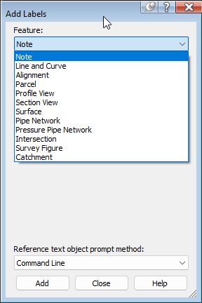
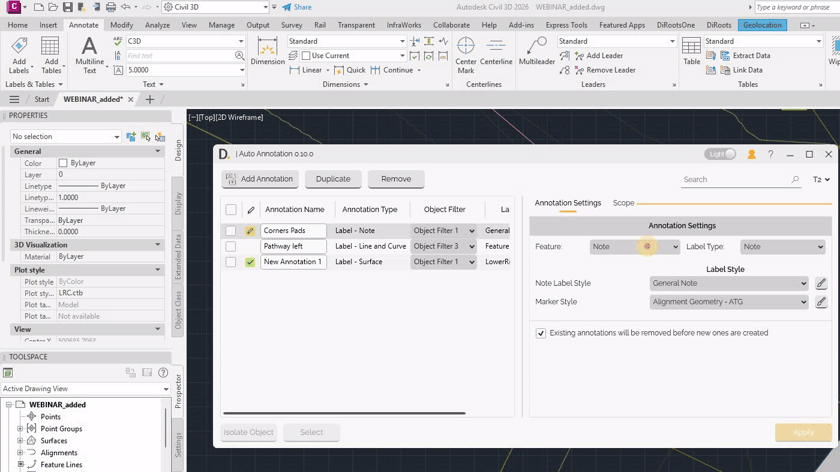
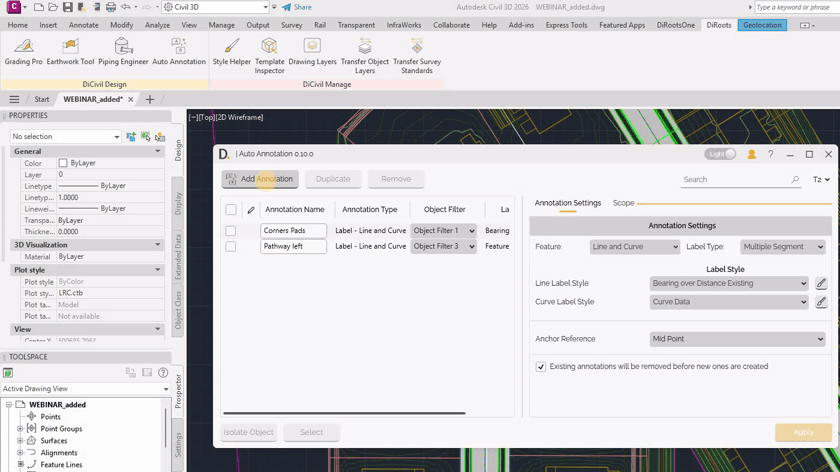
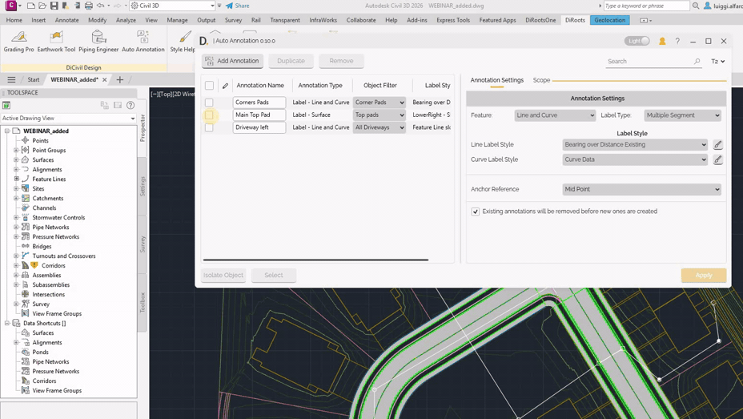

# Annotation Settings
{: .no_toc }

## Table of contents
{: .no_toc .text-delta }

1. TOC
{:toc}

---

# Annotation Settings

The **Annotation Settings** tab is the first configuration tab for each annotation row. It defines the annotation type, label style behavior, and additional inputs required by specific label cases.

## Feature And Label Type

Auto Annotation provides **Feature** and **Label Type** options aligned with Civil 3D label workflows. This helps users stay in a familiar setup pattern while automating placement.

<b>Image:</b> Example list of label features used as reference for Auto Annotation options. 
Note: the version on the image may not reflect the latest version.

## Label Style Selection

For each label category, you can define one or more style-related inputs:

- **Label Style** - Select the style to apply for the selected feature and label type.
- **Open style in Civil 3D** - Use the adjacent button to open or edit style definitions directly in Civil 3D.

Note: the version on the image may not reflect the [latest version of DiCivil Package](https://diroots.com/civil3D-plugins/DiCivil/).

## Additional Inputs For Specific Cases

Some feature and label type combinations require extra parameters.  
Example: **Surface** feature with **Slope** label type can require inputs such as:

- **Surface** to annotate.
- **Anchor reference** or other case-specific references.

Auto Annotation exposes these inputs only when required by the selected label type.

Note: the version on the image may not reflect the [latest version of DiCivil Package](https://diroots.com/civil3D-plugins/DiCivil/).

## Existing Annotation Replacement Behavior

You can control whether previous annotations created by the same auto annotation row are removed during execution:

- **Enabled** - Existing related annotations are removed before creating new ones.
- **Disabled** - New annotations are created without deleting previous ones.

### Re-execution And Relocated Labels

When re-executing:

- If labels were manually dragged/relocated, Auto Annotation uses the previous relocated label location.
- Arrow vertex relocation is not reused because this behavior is not supported.

Note: the version on the image may not reflect the [latest version of DiCivil Package](https://diroots.com/civil3D-plugins/DiCivil/).
