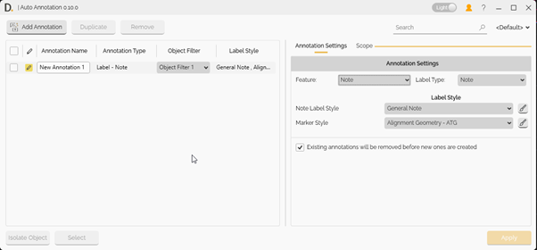
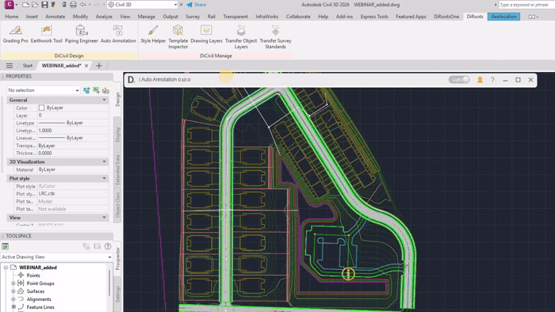
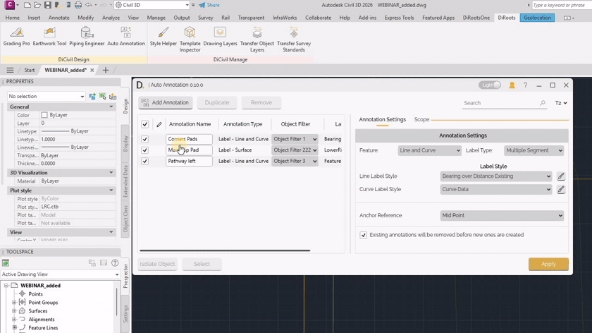

# Main Interface
{: .no_toc }

## Table of contents
{: .no_toc .text-delta }

1. TOC
{:toc}

---

# Main Interface

The Auto Annotation interface provides a row-based workflow where each row defines one annotation setup. The left table manages annotation rows, and the right panel shows the selected row configuration through two tabs: **Annotation Settings** and **Scope**.

<b>Image:</b> Main interface with the annotation list and right-side configuration panel. 
Note: the version on the image may not reflect the [latest version of DiCivil Package](https://diroots.com/civil3D-plugins/DiCivil/).

## Main Workflow

1. Click **Add Annotation** to insert a new row.
2. Select the row to open its configuration on the right panel.
3. Configure **Annotation Settings** and **Scope**.
4. Repeat for additional rows if needed.
5. Check the rows you want to run.
6. Click **Apply** to create annotations.

Note: the version on the image may not reflect the [latest version of DiCivil Package](https://diroots.com/civil3D-plugins/DiCivil/).

## Finding Created Annotations

After creating annotations, you can work with the generated results from selected rows:

- **Select** - Select created annotations linked to selected rows.
- **Isolate / Unisolate** - Isolate or restore display of created annotations to review outputs quickly.

These actions help verify results and focus on specific annotation sets during iteration.

Note: the version on the image may not reflect the [latest version of DiCivil Package](https://diroots.com/civil3D-plugins/DiCivil/).

## Profile Modification

Save, share, and modify profiles to quickly switch between standardized Auto Annotation setups and achieve desired documentation outcomes.

For details, see [Profile](AA-Profile.md).
