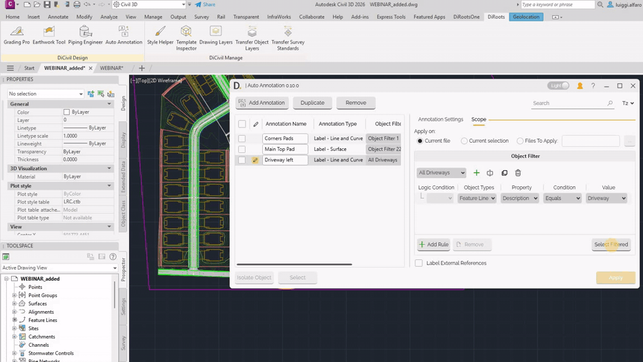
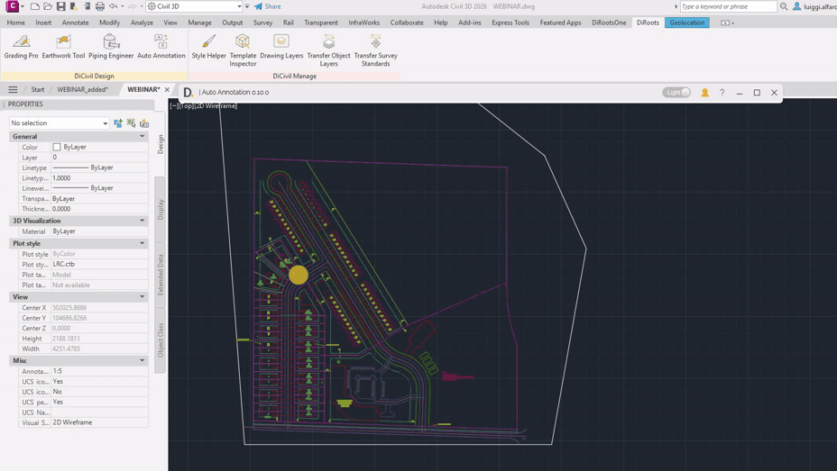

# Scope
{: .no_toc }

## Table of contents
{: .no_toc .text-delta }

1. TOC
{:toc}

---

# Scope

The **Scope** tab defines where annotations are created for each annotation row. It is divided into two main sections:

1. **Apply On**
2. **Object Filter**

## Apply On

This section defines which files are evaluated by the object filter:

- **Current file** - The object filter is applied only to the current drawing file.
- **Current selection** - The object filter is applied only to currently selected objects.
- **Files to apply** - Add one or more files (including closed files) where annotations are created.

Note: the version on the image may not reflect the [latest version of DiCivil Package](https://diroots.com/civil3D-plugins/DiCivil/).

## Object Filter

It defines the location where the new annotations are placed, based on the filtered objects. 

You can:

- Create a new object filter.
- Rename, duplicate, or delete object filters.
- Add or remove rules.
- Build complex logic using **AND / OR** conditions.
- Apply rules to multiple object types and related properties.
- Preview matched objects with **Select Filtered**.

Note: the version on the image may not reflect the [latest version of DiCivil Package](https://diroots.com/civil3D-plugins/DiCivil/).

You can also enable labeling for **external references**. Object Filter uses a rules-based logic similar to DiRootsOne OneFilter for AutoCAD vertical products. 

Note: the version on the image may not reflect the [latest version of DiCivil Package](https://diroots.com/civil3D-plugins/DiCivil/).