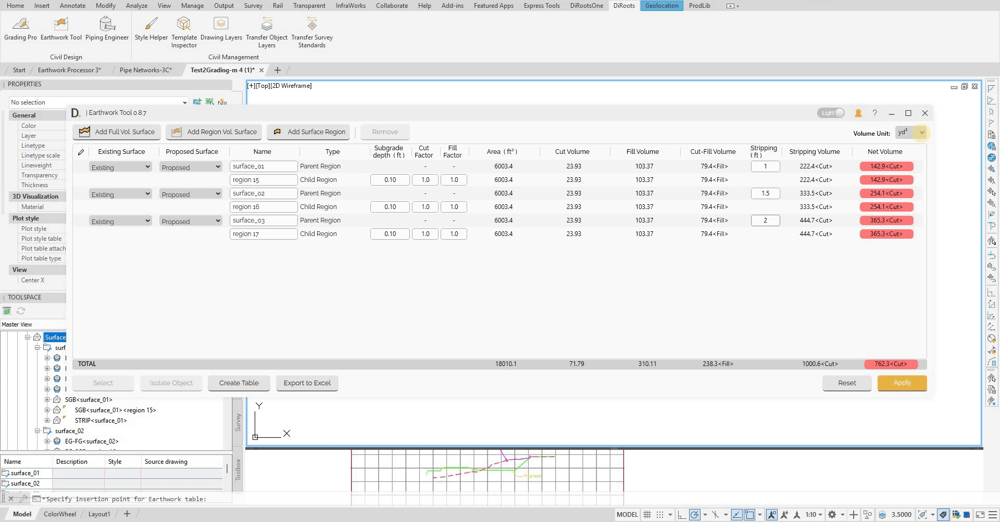
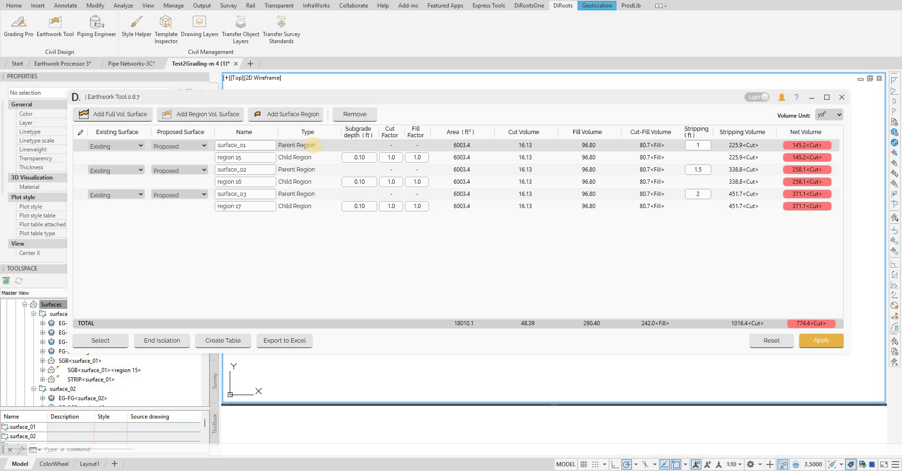
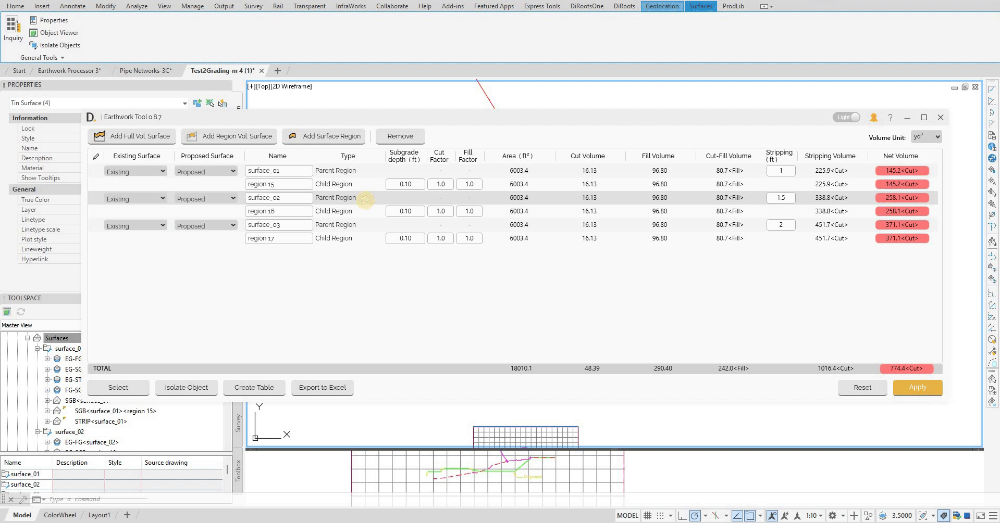

# Additional Features
{: .no_toc }

## Table of contents
{: .no_toc .text-delta }

1. TOC
{:toc}

---

# Additional Features

The Earthwork Tool provides additional features for enhanced workflow, data management, and user experience.

## Overview

Additional features include:
- Volume unit input for dynamic volume unit update.
- Selection and isolation tools to find the related objects.
- Context menu functionality for enhanced workflow.

## Dynamic Volume Units

The tool provides dynamic volume unit management that allows you to switch between different volume units and dynamically updates all volume calculations instantly.

### Unit Options
- **Cubic Meters (m³)** - Metric volume unit.
- **Cubic Yards (yd³)** - Imperial volume unit.
- **Cubic Feet (ft³)** - Imperial volume unit.
- **Acre-Feet (acre-ft)** - Large volume unit for major projects.

Note: the version on the image may not reflect the [latest version of DiCivil Package](https://diroots.com/civil3D-plugins/DiCivil/).

### Select Object Association

Manage associated elements:

- **Select Objects** - Choose elements related to the calculation.
- **Isolate Elements** - Focus on specific components.

Note: the version on the image may not reflect the [latest version of DiCivil Package](https://diroots.com/civil3D-plugins/DiCivil/).

## Context Menu Features

The tool provides context menu functionality to interact directly with the item.

### Right-Click Context Menu
- **Remove table item** - Remove one table item. When deleting a parent, all children are removed.
- **Add Surface Region** - Add child region to parent or existing group.

Note: the version on the image may not reflect the [latest version of DiCivil Package](https://diroots.com/civil3D-plugins/DiCivil/).

