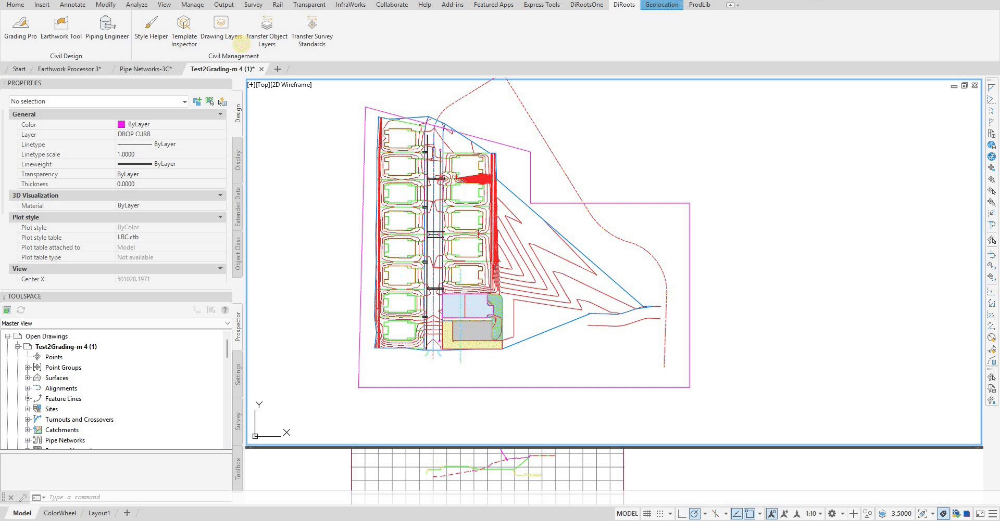
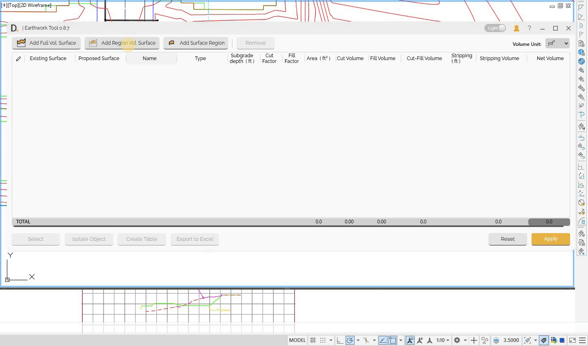

# Calculations
{: .no_toc }

## Table of contents
{: .no_toc .text-delta }

1. TOC
{:toc}

---

# Calculations

The Earthwork Tool provides comprehensive calculation capabilities for cut and fill analysis with both full surface comparisons and region-based calculations.

## Overview

The tool offers two main calculation approaches:
- **Full Surface Calculation** - Complete calculation comparison across entire surfaces.
- **Region Volume Surfaces** - Region-specific calculations with defined boundaries.

You can identify the calculation type for each entry in the results table by checking the **Type** column, which indicates whether it is a full surface comparison, a parent region, or a child region. Additionally, the tool automatically calculates hierarchical totals, so parent and grand total rows display the sum of the relevant cut and fill volumes for their respective regions.

## Full Surface Calculation

The Earthwork Tool provides comprehensive surface comparison capabilities for calculating cut and fill volumes across entire project areas.

Full surface calculation allows you to:
- Calculate cut and fill quantities by comparing two surfaces across the entire project area.

### Full Volume Surface Workflow

#### Full Surface Calculation Workflow

1. **Open Earthwork Tool** from the DiRoots tab in Civil 3D.
2. In the main interface, click **Add Full Volume Surface** to start a new calculation.
3. **Select Existing Surface** – Choose the current ground surface representing pre-construction conditions.
4. **Select Proposed/Future Surface** – Choose the design or future ground surface representing post-construction conditions.
5. Click the **Execute** button to run the calculation and generate cut and fill volumes.

Note: the version on the image may not reflect the [latest version of DiCivil Package](https://diroots.com/civil3D-plugins/DiCivil/).

#### Calculation Results

The tool provides volume analysis:

- **Cut Volume** - Total volume of material to be removed.
- **Fill Volume** - Total volume of material to be added.
- **Net Volume** - Difference between cut and fill.

## Region Calculations

The Earthwork Tool provides region-based volume calculations with defined boundaries for region defined earthwork calculation in specific project areas.

### Overview

Region calculations allow you to:
- Calculate volumes for specific areas using defined boundaries.
- Configure subgrade base layer per defined region.
- Define hierarchical parent-child groups with partial total calculation.

### Region Workflow

The region workflow combines parent and child regions to create a hierarchical calculation system where parent regions group multiple child regions and provide child group totals.

### Creating Parent Regions

1. **Access Parent Region Feature**
   - Click "Add Region Volume Surfaces" in main UI

2. **Parent Region Configuration**
   - Set parent region name and description
   - Assign existing and proposed surfaces
   - Configure topsoil stripping thickness for entire parent group

3. **Child Region Management**
   - Each child will inherit stripping depth configuration from the parent
   - Parent calculates totals from all children
   - Create multiple child regions under parent

### Creating Child Regions

1. **Access Child Region Feature**
   - Select parent and Click "Add Surface Region" (Children Region). (or Right click on the parent region row in the table and click on 'Add Surface Region')
   - Select closed region boundaries
   - Configure individual region settings

2. **Child Region Configuration**
   - Set region name and description
   - Each child inherits the existing and proposed surfaces and stripping thickness from the parent
   - Set the subgrade base depth for this specific child region

3. **Individual Calculations**
   - Each child region calculates independently
   - Results include cut/fill volumes with stripping consideration
   - Type column shows "Child Region" for identification

Note: the version on the image may not reflect the [latest version of DiCivil Package](https://diroots.com/civil3D-plugins/DiCivil/).

### Integrated Workflow Example: Construction Phasing

**Parent Region: "Phase 1 Construction"**
- Stripping thickness: 0.15m (applies to all children)
- Existing surface: "Existing_Ground"
- Proposed surface: "Phase1_Design"

- **Child Region 1: "Building Pad A"**
  - Subgrade base depth: 0.30m
  - Inherits: Stripping thickness 0.15m, Existing surface, Proposed surface
  - Results: Cut: 2,500 m³, Fill: 1,800 m³, Net: 700 m³ cut

- **Child Region 2: "Building Pad B"**
  - Subgrade base depth: 0.25m
  - Inherits: Stripping thickness 0.15m, Existing surface, Proposed surface
  - Results: Cut: 3,200 m³, Fill: 2,100 m³, Net: 1,100 m³ cut

- **Child Region 3: "Parking Area"**
  - Subgrade base depth: 0.20m
  - Inherits: Stripping thickness 0.15m, Existing surface, Proposed surface
  - Results: Cut: 1,500 m³, Fill: 2,200 m³, Net: 700 m³ fill

**Parent Region Totals :**
- Total Cut: 7,200 m³
- Total Fill: 6,100 m³
- Net: 1,100 m³ cut

## Totals Description

The tool maintains hierarchical totals that automatically update when calculations are executed.

### Total Hierarchy

   - Sum of full volume surface and parent region volume surfaces.
   - Project-wide earthwork balance.
   - Includes all stripping and subgrade considerations.

## Best Practices

- **Verify Region Boundaries** - Ensure regions are properly closed.
- **Check Surface Assignment** - Verify correct surfaces are assigned to regions.
- **Plan Region Hierarchy** - Plan parent-child relationships logically.
- **Use Descriptive Names** - Name regions clearly for easy identification.
