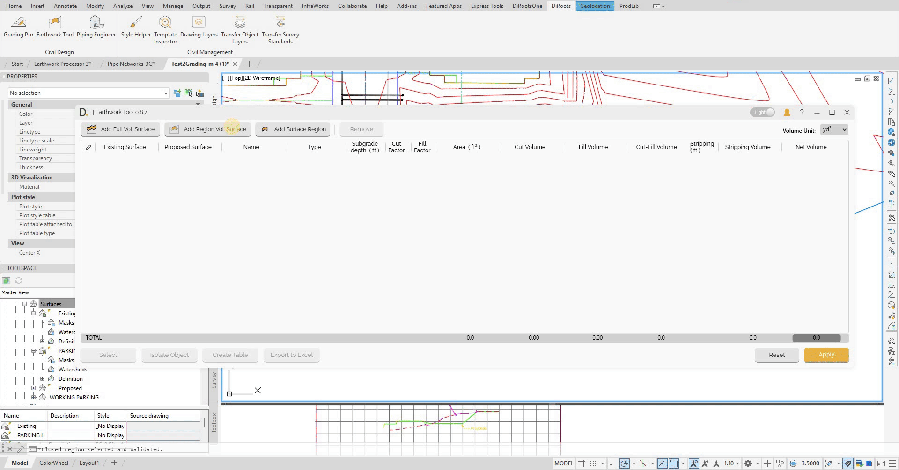

# Layer Consideration
{: .no_toc }

## Table of contents
{: .no_toc .text-delta }

1. TOC
{:toc}

---

# Layer Consideration

The Earthwork Tool provides layer consideration capabilities with two optional layers that make earthwork calculations easier since the topsoil stripping and subgrade base layers are usually considered when performing earthwork calculations.

## Overview

The tool considers two optional layers to simplify earthwork calculations:
- **Topsoil Stripping Layer** - Configurable depth for removing topsoil before construction.
- **Subgrade Base Layer** - Configurable depth for subgrade preparation below proposed surfaces.

Automatic surface generation creates surfaces from the existing and proposed surfaces, using specific naming conventions. Both the topsoil stripping and subgrade base layers are fully integrated into the volume calculations.

### Automatic Surface Generation

For automatic surface generation, the tool creates:
- **Stripping Topsoil Surface** - Generated from existing ground surface with specified stripping depth.
- **Subgrade Base Surface** - Generated from proposed surface with specified subgrade depth for defined regions.

#### Surface Naming Convention

The tool automatically names generated surfaces using the following convention:
- **'SGB'** - Subgrade Base surfaces.
- **'STRIP'** - Stripping Topsoil surfaces.
- **'EG'** - Existing Ground surfaces.
- **'FG'** - Future Ground (Proposed) surfaces.

Note: the version on the image may not reflect the [latest version of DiCivil Package](https://diroots.com/civil3D-plugins/DiCivil/).

## Topsoil Stripping Layer

The topsoil stripping layer is an optional layer that accounts for the removal of topsoil before construction begins. This layer is typically considered in earthwork calculations to ensure accurate volume estimates.

### Full Surface Stripping

For full surface comparisons, the stripping layer applies a single configurable depth across the entire project area.

### Region-Based Stripping

For region-based calculations, all child regions inherit parent stripping depth. Same stripping depth across all children in parent group.

Note: the version on the image may not reflect the [latest version of DiCivil Package](https://diroots.com/civil3D-plugins/DiCivil/).

## Subgrade Base Layer

The subgrade base layer is an optional layer that accounts for the preparation depth below the proposed surface. This layer is commonly considered in earthwork calculations to ensure proper foundation preparation.

### Region-Based Subgrade Base

For region-based calculations, each child region can have its own individual subgrade base depth configuration.

Note: the version on the image may not reflect the [latest version of DiCivil Package](https://diroots.com/civil3D-plugins/DiCivil/).

## Data Storage

### Calculation Data Storage

The tool stores the calculation data for analysis and reporting in the file:

- **Structured Organization** - Tool creates specific folder and surface naming structure.
- **Critical Structure** - If surface names are modified, data will not display correctly.
- **User Warning** - Do not manually modify created folders or surface names as it could affect the available data in the tool.

