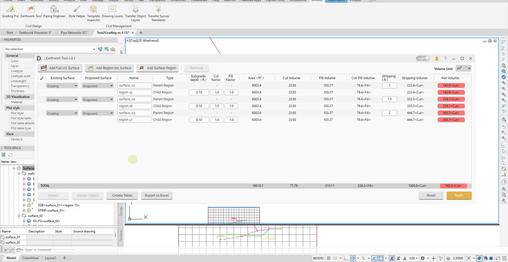
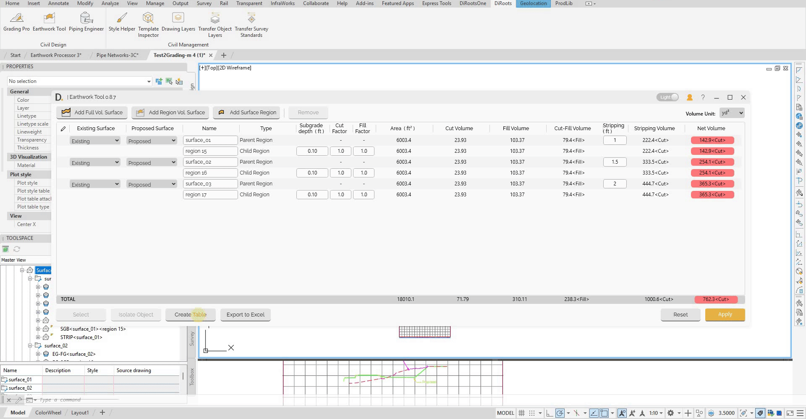

# Reporting
{: .no_toc }

## Table of contents
{: .no_toc .text-delta }

1. TOC
{:toc}

---

# Reporting

The Earthwork Tool provides the Excel export functionality for detailed analysis and reporting.

## Overview

Reporting features allow you to:
- Export table data to Excel for further analysis.
- Create AutoCAD tables for drawings.

## Excel Export

#### Export Process
1. **Export Calculations** - After your data is ready, click on 'Export to Excel' button.
2. **Generates Excel File** - Creates formatted Excel workbook.

Note: the version on the image may not reflect the [latest version of DiCivil Package](https://diroots.com/civil3D-plugins/DiCivil/).

##  Table Creation

### Creating Tables in Civil3D

The tool can create tables directly in your drawings for documentation and presentation.

#### Table Creation Process
1. **Create Table** - After your data is ready, click on 'Create Table' button.
2. **Set Table Style** - Set table style.
3. **Insert Table** - Place table in drawing at specified location.

Note: the version on the image may not reflect the [latest version of DiCivil Package](https://diroots.com/civil3D-plugins/DiCivil/).
