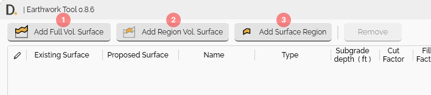

# Earthwork Tool User Guide

{: .fs-6 .fw-300 }

## Overview

The Earthwork Tool helps you easily perform earthwork cut and fill volume calculations, including region-based volume calculations, considering topsoil stripping and subgrade base layers. It's your solution for construction earthwork workflows, built for accuracy and speed.

**Key Features:**
- **Full Volume Surface** - Complete surface comparison between surfaces for cut/fill calculations.
- **Region Volume Surfaces** - Multiple region-based cut/fill calculations with defined boundaries.
- **Topsoil Stripping Layer** - Includes Topsoil Stripping surfaces consideration with configurable depth.
- **Subgrade Base Layer** - Includes Subgrade base layer consideration with configurable depth for defined regions.
- **Dynamic Volume Units** - Switch between m³, yd³, ft³, acre-ft instantly.
- **Report** - Create Civil3D tables and export data to Excel for reporting purposes.

## Getting Started

### Main Interface

The Earthwork Tool is accessed through the DiRoots tab in Civil 3D. The main UI provides two primary calculation types:

- **Add Full Volume Surface** - Complete calculation comparison across entire surfaces. (Label 1 button in image 01)
- **Add Region Volume Surfaces** - Region-specific calculations with defined boundaries.

    - **Add Region Vol. Surface (Parent Region)**: Group all the children region calculations (Label 2 button in image 01).
    - **Add Surface Region (Children Region)**: Individual boundary defined region. (Label 3 button in image 01)

  
<b>Image:</b> Tool snapshot showing the different earthwork calculation types 
Note: the version on the image may not reflect the [latest version of DiCivil Package](https://diroots.com/Civil3D-plugins/DiCivil/).

### Basic Workflow

1. **Open Earthwork Tool** - From the DiRoots tab.
2. **Choose Calculation Type** - Add full volume or region volume.
3. **Select Surfaces** - Choose existing and proposed/future surfaces.
4. **Configure Layers (optional)** - Set up topsoil stripping and subgrade base layers.
5. **Execute Calculations** - Run volume analysis.
6. **Review Results** - Check cut/fill volumes and totals.
7. **Create Reports** - Export data to Excel or create Civil3D tables.

Note: the version on the image may not reflect the [latest version of DiCivil Package](https://diroots.com/civil3D-plugins/DiCivil/).

## Documentation Structure

This user guide is organized into the following sections:

- **[Calculations](EW-Calculations.md)** - Detailed explanation of calculation methods, parent and child region workflows, and totals description
- **[Layer Consideration](EW-Layer-Consideration.md)** - Topsoil stripping and subgrade base surface configuration and data storage
- **[Reporting](EW-Reporting.md)** - Excel export and AutoCAD table creation
- **[Additional Features](EW-Additional-Features.md)** - Context menus, selection tools, and workflow features