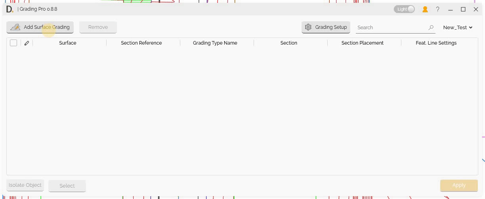
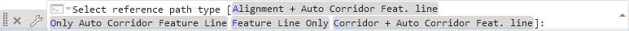
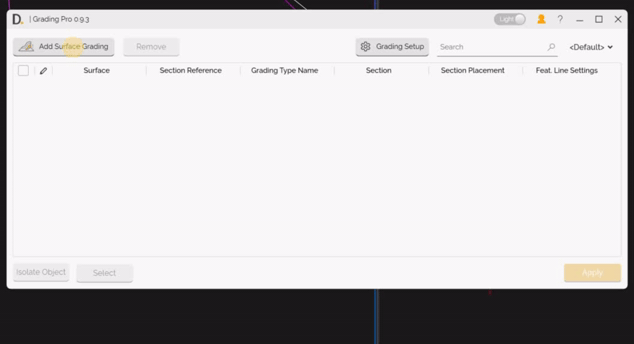
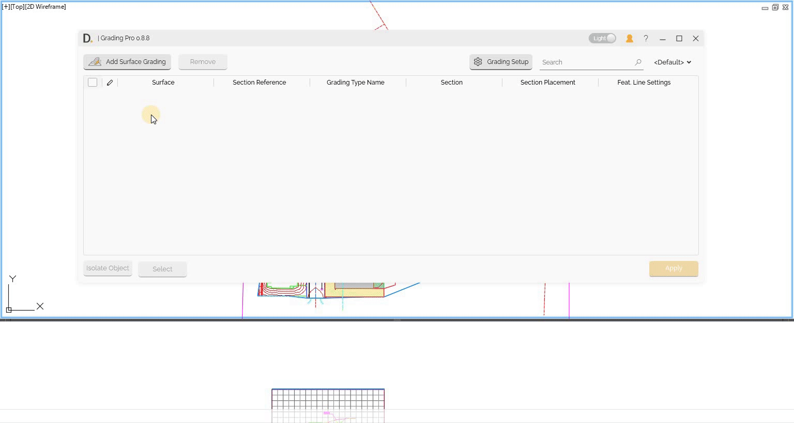

# Main Interface
{: .no_toc }

## Table of contents
{: .no_toc .text-delta }

1. TOC
{:toc}

---

# Main Interface

The Grading Pro tool is accessed through the DiRoots tab in Civil 3D. The main interface provides a comprehensive workflow for surface grading operations, from initial setup to final application.

## Overview

The main interface serves as the central hub for all Grading Pro operations, allowing you to:

- **Add Surface Grading** - Primary function to modify and create new surfaces.
- **Access Setup Grading** - Configure sections and section placements.
- **Select Reference Path** - Define the section reference path for section placement.
- **Configure Feature Lines** - Set up feature line settings.
- **Modify Profiles** - Adjust grading profiles as needed.
- **Find and Define Related Gradings** - Locate and configure grading types.
- **Apply Grading** - Execute the surface modifications.

## Main Interface Components

### Add Surface Grading button

The 'Add Surface Grading' button is the primary function that initiates the surface grading process. This button serves as the entry point for creating or modifying grading surfaces and provides access to all grading configuration options.

### Surface Selection And Creation

After adding a surface grading, choose existing surfaces to modify from your Civil 3D project or create a new one:

Note: the version on the image may not reflect the [latest version of DiCivil Package](https://diroots.com/civil3D-plugins/DiCivil/).

### Section Reference

Define the section reference path for section placement by selecting the appropriate path type. The Section Reference is the main path that defines the origin of the section placement in the 3D space.

#### Reference Path Type Options

After clicking on the column button, the user is  prompted to select a reference path type, you can choose from the following options:

- **Alignment + Auto Corridor Feature Line**  
  Use both an alignment and an auto corridor feature line as the reference.

- **Only Auto Corridor Feature Line**  
  Use only the automatically generated corridor feature line as the reference.

- **Feature Line**  
  Use any existing feature line as the reference path. The stations on this objects are defined from the creation origin of the feature line.

- **Corridor + Auto Corridor Feature Line**  
  Use the corridor and the corridor feature line as the reference.

Select the option that best fits your scenario. The interface will display these options in Civil3D, as shown in the image below:

<b>Image:</b> Snapshot showing the multiple reference path type options  
Note: the version on the image may not reflect the [latest version of DiCivil Package](https://diroots.com/Civil3D-plugins/DiCivil/).

Note: the version on the image may not reflect the [latest version of DiCivil Package](https://diroots.com/civil3D-plugins/DiCivil/).

### Grading Type Name

Assign a custom name to your grading configuration for easy identification and reference later. This name helps you quickly recognize and manage different grading setups within your project.

### Section Selection

Select your section setups from the configured section definitions.

For detailed information on section configuration, see [Section Setup](GP-Section-Setup.md).

### Section Placement Selection

Select your section placements that define where sections are applied.

For detailed information on Section Placement Setup, see [Section Placement Setup](GP-Section-Placement-Setup.md).

### Feature Line Settings

The Feature Line Settings panel allows you to configure how feature lines are created and managed as part of your grading design. In this section of the interface (see image below), you can:

- **Select/Create Output Site** – Specify the target site for new feature lines.
- **Assign Feature Line Style** – Choose the style to apply to generated feature lines.
- **Layer Assignment** – Set the layer for output feature lines.

#### Feature Line Breakline Settings

You can set **Feature Line Breakline Settings** so that when feature lines are added to the surface, they are applied as breaklines with the correct options. This ensures surfaces are built or updated consistently with your grading design.

- **Default values** – If you leave any breakline options unset, the tool uses sensible defaults (as in the Civil 3D Add Breaklines workflow). You can rely on these when you don’t need to change specific settings.
- **Input logic** – The UI follows the same input logic as Civil 3D’s **Add Breaklines** command. Extra inputs are available where needed for different breakline type cases.
- **Profile storage** – Breakline settings are saved in grading profiles together with the rest of your configuration. Existing profiles continue to work as before; the new settings are stored without disrupting previous profile usage.

Note: the version on the image may not reflect the [latest version of DiCivil Package](https://diroots.com/civil3D-plugins/DiCivil/).

### Accessing Grading and Section Setups

The main interface provides different ways to access configuration and setup options:

- **Grading Setup** - Click the "Grading Setup" button (with gear icon) in the upper-right section to access overall grading configuration options.
- **Current Section Setup** - Click the gear icon next to the "Section" column header to access the current selected Section Setup.
- **Current Section Placement Setup** - Click the gear icon in the "Section Placement" column to access the current selected section placement settings.

These setup options allow you to customize the grading behavior and section configurations before applying them to your surfaces.

### Apply Grading

Execute the surface modifications with your configured settings:

- **Check Gradings to apply** - Check the settings the user wants to execute.
- **Apply Grading** - Click on the 'Apply' button to set the grading on the checked grading setups.
- **Results Confirmation** - The status column shows the status of each executed grading.

Note: the version on the image may not reflect the [latest version of DiCivil Package](https://diroots.com/civil3D-plugins/DiCivil/).

### Profile Modification

Save, share and modify grading profiles to achieve quick desired design outcomes:

For detailed information on profile management, see [Profile Management](GP-Profile.md).

