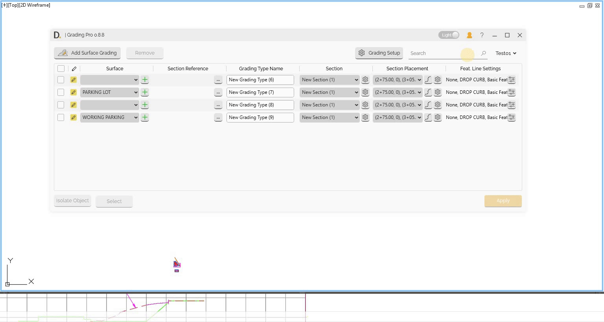

# Profile
{: .no_toc }

## Table of contents
{: .no_toc .text-delta }

1. TOC
{:toc}

---

# Profile

Grading Pro includes a profile system that allows you to save and reuse grading configuration and setups, making it easy to maintain consistent configurations across multiple projects and use multiple configurated profiles quickly.

## Overview

Profile system allows you to:
- Save configuration settings for reuse.
- Switch between different profile templates.
- Maintain consistent settings across projects.
- Share profiles across teams.

## What's saved in the profile

The following settings are saved in the profiles.

- The set configured Grading types.
- The customized set of Sections Setup.
- The customized set of Sections Placement Setup.
- The set of configuration applied to the entire document.

Note: the version on the image may not reflect the [latest version of DiCivil Package](https://diroots.com/civil3D-plugins/DiCivil/).
