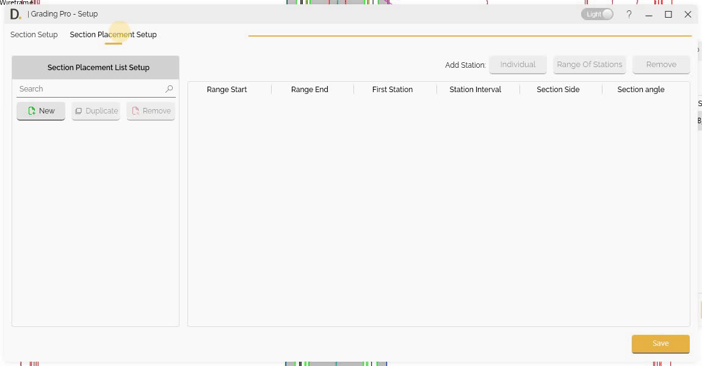
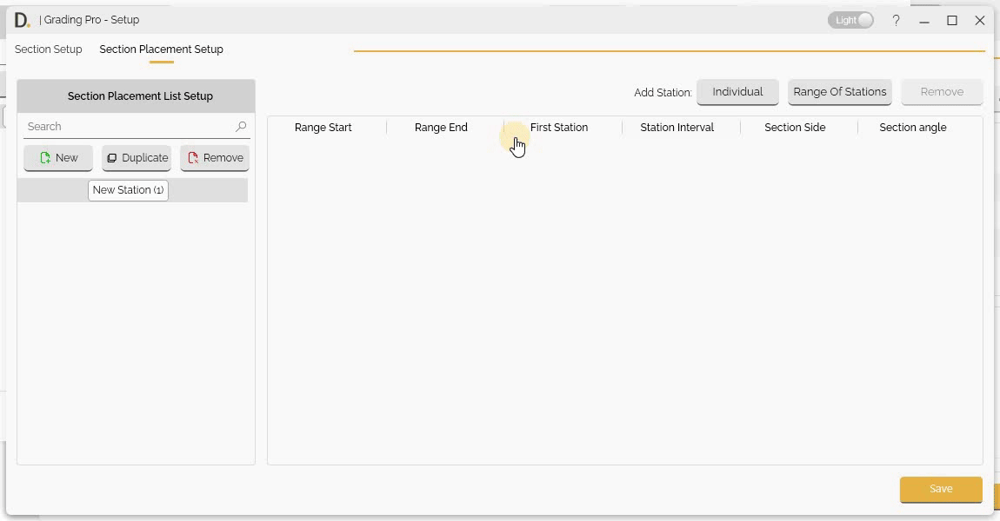
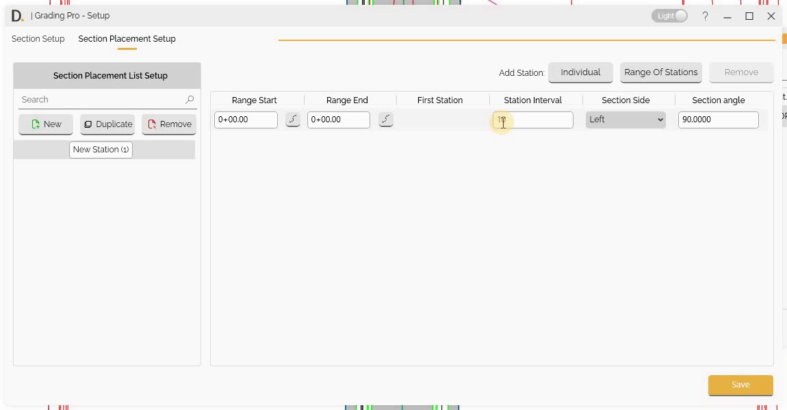
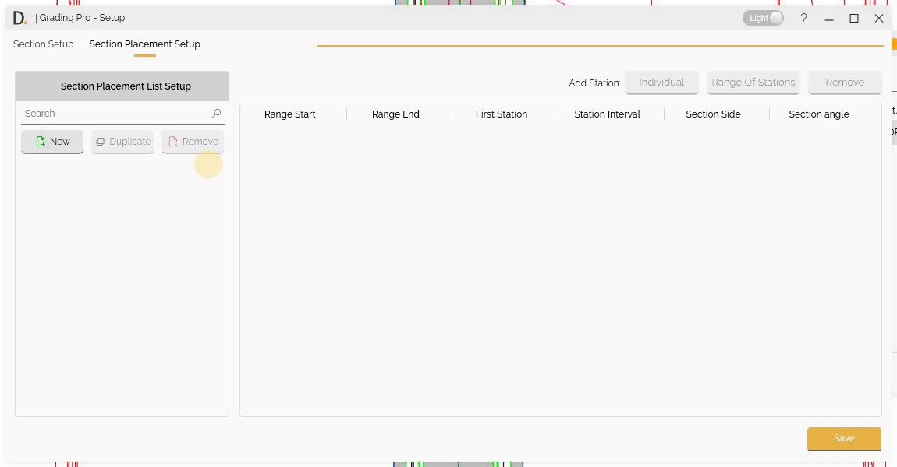
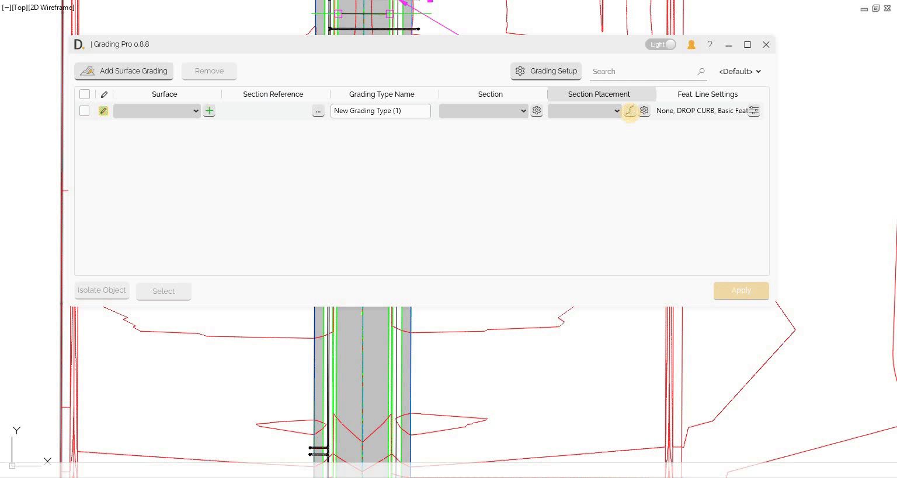

# Section Placement Setup
{: .no_toc }

## Table of contents
{: .no_toc .text-delta }

1. TOC
{:toc}

---

# Section Placement Setup

Grading Pro provides Section Placement Setup capabilities for creating and organizing section placements along reference paths with individual and range-based configurations.

## Overview

Section placement setup allows you to:
- Create individual section placements at specific locations.
- Generate range-based section placements with intervals.
- Configure side and angle settings for section placement.

## Manage Section Placement Items

### Creating, Duplicating and Removing

Manage your Section Placement list by creating new, setting a associated name to later refer to the configuration, duplicating, and removing new types

Note: the version on the image may not reflect the [latest version of DiCivil Package](https://diroots.com/civil3D-plugins/DiCivil/).

## Individual Section Placements

After defining the Section Placement Item, the user can add multiple individual stations on the selected Section Placement

### Creating Individual Section Placements

Create section placements at specific locations:

- **Add Individual Station** - Create individual section from the 'Individual' button.

Configure individual section placement settings:

- **First Station Input** - Enter the station value for the section placement. This input sets the location along the reference path where the section will be placed. The value can be typed directly or selected using the station picker button to choose a precise location from the drawing.

- **Station Selection button** - Select individual stations for modification. This feature allows the user to pick the exact point location from the drawing for each individual section placement.

Note: the version on the image may not reflect the [latest version of DiCivil Package](https://diroots.com/civil3D-plugins/DiCivil/).

> **Note:** You can also add a station directly from the main UI, as described in the "Creating Individual Section Placements from Main UI" section at the end of this page.

## Range-based Section Placements

After defining the Section Placement Item, the user can add multiple individual stations on the selected Section Placement

### Creating Range-based Section Placements

Generate multiple individual section placements in ranges with intervals:

- **Add Range of Stations** - Create range-based section placements from the 'Range Of Stations' button

Configure range-based section placement settings:

- **Range Start Input** - Enter the starting station value for the range. This input sets the beginning location along the reference path where the range will start.

- **Range End Input** - Enter the ending station value for the range. This input sets the final location along the reference path where the range will end.

For the previous inputs, the value can be typed directly or selected using the station picker button to choose a precise location from the drawing.

- **Station Interval Input** - Enter the interval value between individual stations within the range. This defines the spacing between each section placement generated within the specified range.

- **Station Selection Buttons** - Select precise station locations from the drawing for Range Start, Range End, and First Station. These features allow the user to pick exact point locations from the drawing for each range parameter.

Note: the version on the image may not reflect the [latest version of DiCivil Package](https://diroots.com/civil3D-plugins/DiCivil/).

## Additional Input Settings

### Side and Angle Settings
Configure section placement orientation and side:

- **Side Selection** - Choose which side of the path to place sections. Right, Left or Both sides.
- **Angle Definition** - Define the angle of section placement.

Note: the version on the image may not reflect the [latest version of DiCivil Package](https://diroots.com/civil3D-plugins/DiCivil/).

## Creating Individual Section Placements from Main UI

You can create multiple individual stations directly from the main interface using the squiggly line icon in the "Section Placement" column. This feature allows you to:

- **Create Quick Individual Stations** - Click the squiggly line icon to create individual stations directly from the main UI.
- **Side Definition** - Define individual stations on the side where you are clicking.
- **Default Angle and naming** - Stations are created with a default 90-degree angle and default naming based on the picked location.
- **Section Reference Constraint** - Station selection is constrained to the Section Reference that has been selected.

This provides a fast and intuitive way to place individual stations without navigating to separate setup dialogs. After creation, the user can go to the settings to make any update.

Note: the version on the image may not reflect the [latest version of DiCivil Package](https://diroots.com/civil3D-plugins/DiCivil/).

