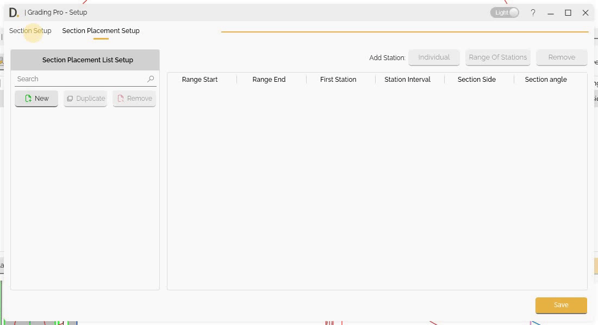
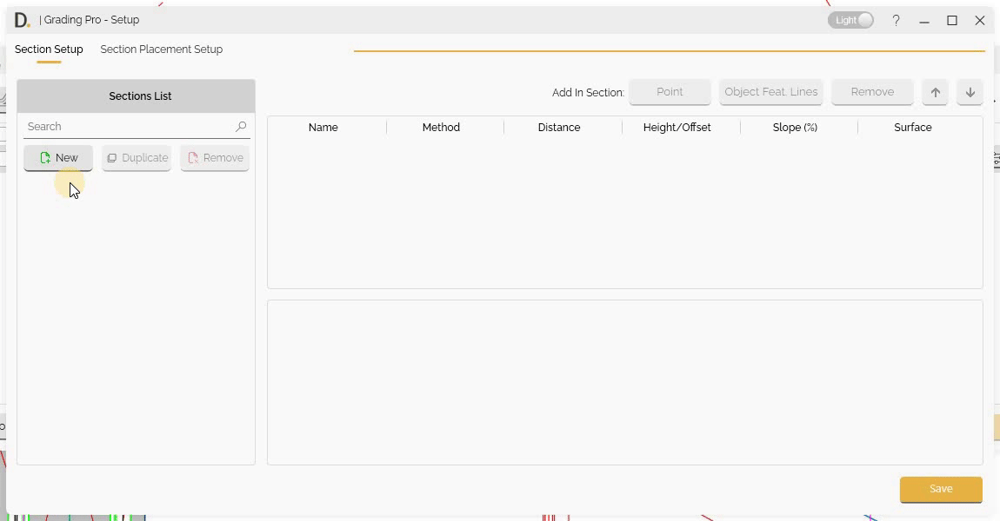
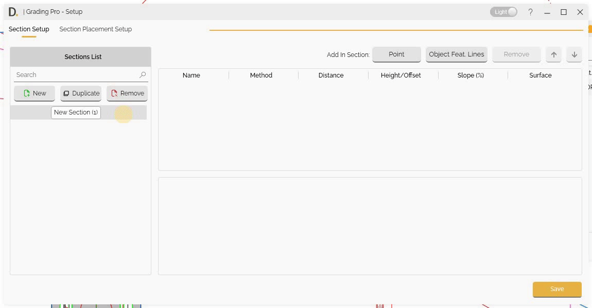
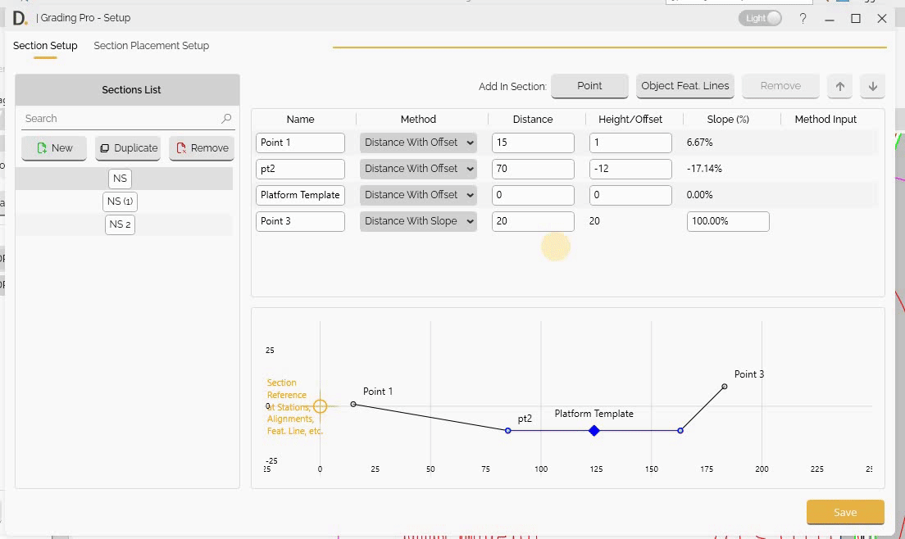
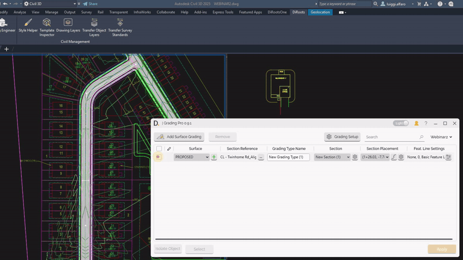
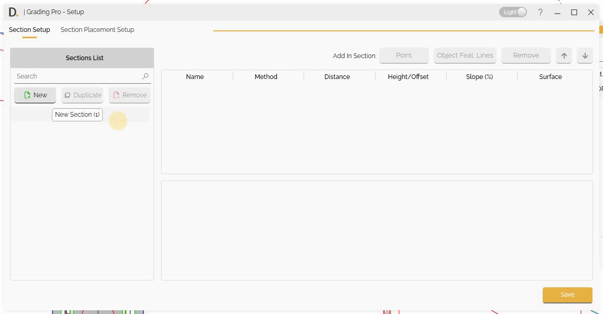
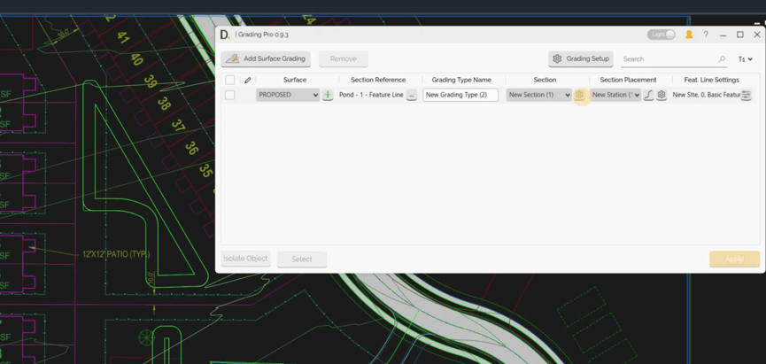

# Section Setup
{: .no_toc }

## Table of contents
{: .no_toc .text-delta }

1. TOC
{:toc}

---

# Section Setup

Grading Pro provides a section setup capability with multiple definition methods for precise grading design.

## Overview

Section configuration allows you to:
- Create Section types that can be reused across projects.
- Define sections using multiple point methods (distance with offset, distance with slope, offset with slope, slope to surface, point to feature line).
- Create nested sections for advanced and flexible grading designs.
- Setup section points efficiently with add, remove, and reorder capabilities.
- Shows each point location on the section view.
- Add feature lines as objects in your section definitions for greater control and flexibility.

## Manage Sections

### Creating, Duplicating and Removing

Manage your Section list by creating new, setting an associated name to later refer to the configuration, duplicating and removing new types.

Note: the version on the image may not reflect the [latest version of DiCivil Package](https://diroots.com/civil3D-plugins/DiCivil/).

## Point Definition Methods

After creating a new section, select on the left and start adding points in the section. On each point definition, the user can define the following different methods.

### Distance with Offset

Define a point based on distance and offset:

- **Distance** - Specify distance from the previous point or origin.
- **Height/Offset** - Specify offset values from the previous point or origin.

Note: the version on the image may not reflect the [latest version of DiCivil Package](https://diroots.com/civil3D-plugins/DiCivil/).

### Distance with Slope

Define a point based on distance and slope:

- **Distance** - Specify distance from the previous point or origin.
- **Slope Percentage** - Specify slope percentage for point or origin.

Note: the version on the image may not reflect the [latest version of DiCivil Package](https://diroots.com/civil3D-plugins/DiCivil/).

### Offset with Slope

Define a point by offset and slope:

- **Height/Offset** - Specify offset values from the previous point or origin.
- **Slope Percentage** - Specify slope percentage for point elevation.

Note: the version on the image may not reflect the [latest version of DiCivil Package](https://diroots.com/civil3D-plugins/DiCivil/).

### Slope to Surface

Define points by slope from the previous point projected to the selected surface:

- **Offset from Path** - Specify offset distance from the reference path.
- **Slope Percentage** - Specify slope percentage for point elevation.

Note: the version on the image may not reflect the [latest version of DiCivil Package](https://diroots.com/civil3D-plugins/DiCivil/).

### Point to Feature Line

Define a point that connects to a target feature line on the section direction:

- **Feature Line Selection** - Select a target feature line using the pick button. The feature line name is displayed when selected.
- **Point Calculation** - The point position is calculated at the feature line intersection on the section plane at runtime.

This method allows you to create sections that align with existing feature lines (e.g., pathway case connection to road). The feature line is stored in the profile based on its unique name, allowing it to be reused across different projects. If the feature line does not exist in the active file, an error message will be displayed.

Since the new target intersection point at the feature line is unknown before execution, the section view result could be different from the real transversal section created when using this method. In the section view when using this method, it shows an horizontal arrow with a semi-circular reference. 

Note: the version on the image may not reflect the [latest version of DiCivil Package](https://diroots.com/civil3D-plugins/DiCivil/).

## Nested Section
Grading Pro allows you to create nested sections that can be placed at different locations and orientations, enabling advanced and flexible grading designs. Nested sections are created at runtime and can reference other sections within your design.
### Nested Section At Object
Define a nested section that can be placed at any direction from any location using an 'Object Feature Line' as reference:
- **Object Selection** - Select an Object Feature Line from the current section's objects list. This object serves as the reference placement for the nested section placement.
- **Point and Direction** - Specify the insertion point and direction for the nested section based on the original 'Object Feature Line'. Use the pick button to select a point and direction in the drawing (two clicks), or manually enter coordinates and direction vector values.
- **Nested Section Selection** - Choose the section that will be created at the specified point and direction from the available sections list.

This method enables you to create advanced and flexible grading designs by nesting different sections at various locations and orientations. The nested section is created at runtime, with the point position calculated using the projected direction.

**Important Notes:**
- The nested section could not necessarily be set on the same section plane as the parent section. The nested section position is set based to the Object defined point and direction. 
- This method does not modify subsequent points in the section.

The following example demonstrates adding 2 nested sections 'New Section (2)' to an object defined by 'New Section (1)':

Note: the version on the image may not reflect the [latest version of DiCivil Package](https://diroots.com/civil3D-plugins/DiCivil/).

## Object Feature Line Integration

Grading Pro allows you to add feature lines as objects in your section definitions, providing greater control and flexibility in grading design.

### Overview

Feature line integration enables you to:
- Use existing feature lines of platforms, or other geometric objects as part of your section definitions.
- Maintain exact geometry from existing designs while incorporating them into new grading scenarios.
- Achieve precise control over complex geometric forms.
- Ensure design consistency with existing elements.

### Adding Object Feature Lines into Sections

Follow these steps to add feature lines to your section definitions:

1. **Open Section Setup**  
   Go to the "Section Setup" tab within Grading Pro.

2. **Add Object Feature Lines**  
   Click the "Object Feat. Lines" button to begin the integration process.

3. **Select Feature Lines or Objects**  
   Choose the set of feature lines like platforms, or other geometric objects you want to include in your section.

4. **Specify Origin Point**  
   Select where the feature line will connect to the section. You can choose the midpoint, an endpoint, or a custom point along the feature line. The origin point determines how the feature line is positioned within the section and the elevation referenced from the object is at zero.

5. **Set Orientation**  
   Define the orientation by selecting which end or direction the feature line should follow. Adjust rotation or placement as needed to ensure the feature line aligns correctly with your section design.

Note: the version on the image may not reflect the [latest version of DiCivil Package](https://diroots.com/civil3D-plugins/DiCivil/).

### Applications

Feature line integration supports various grading design scenarios.

- **Reusable Objects** - Create standard feature line elements that can be applied across multiple sections, saving time while maintaining consistent design quality and workflow efficiency.

## Point Management

### First Point

- The first point could be placed on the origin (0, 0) or at a distance offset from the origin.

Note: the version on the image may not reflect the [latest version of DiCivil Package](https://diroots.com/civil3D-plugins/DiCivil/).

### Adding and Removing Points

Add or remove points to section setups:

Note: the version on the image may not reflect the [latest version of DiCivil Package](https://diroots.com/civil3D-plugins/DiCivil/).

### Reordering Points

Reorder points in section definitions:

Note: the version on the image may not reflect the [latest version of DiCivil Package](https://diroots.com/civil3D-plugins/DiCivil/).

### Parallel Creation

You can connect section points with a **parallel offset connection** from the original reference. Points that use this connection are joined by a parallel feature line that follows the section reference, example usage cases are swales, etc.

**In the Section Setup configuration table:**

- **Parallel Connection checkbox column** – The point table includes a *Parallel Connection* column. For each point, check the box to use a parallel offset connection from the reference for that point. When checked, the point is included in the parallel feature line; when unchecked, it is not.

The tool creates the **parallel feature line** from the **first section placement** through the **last section placement**. The feature line follows the **location and elevation** defined by the section at each placement, so the grading stays consistent with your section definition along the full extent.

Note: the version on the image may not reflect the [latest version of DiCivil Package](https://diroots.com/civil3D-plugins/DiCivil/).