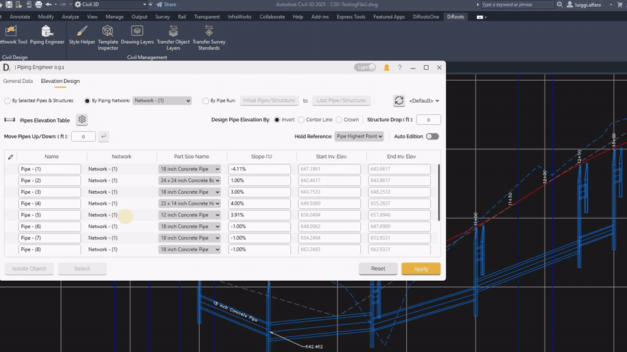
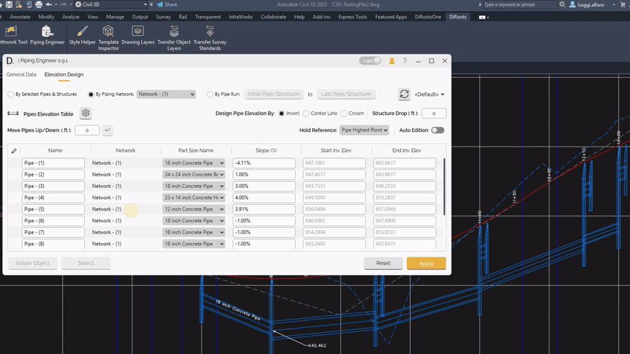
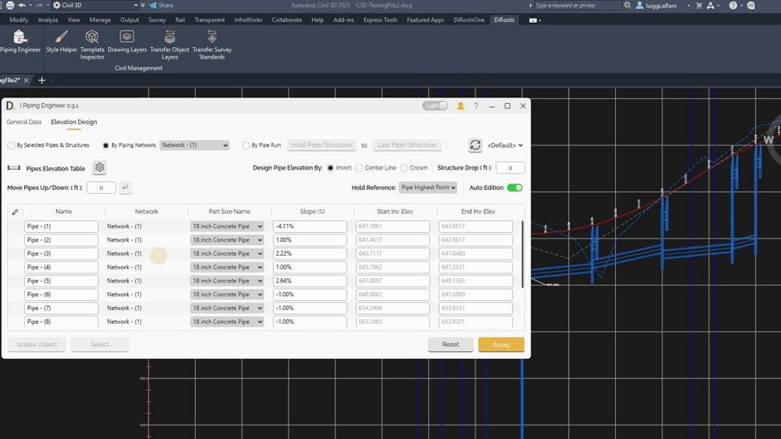
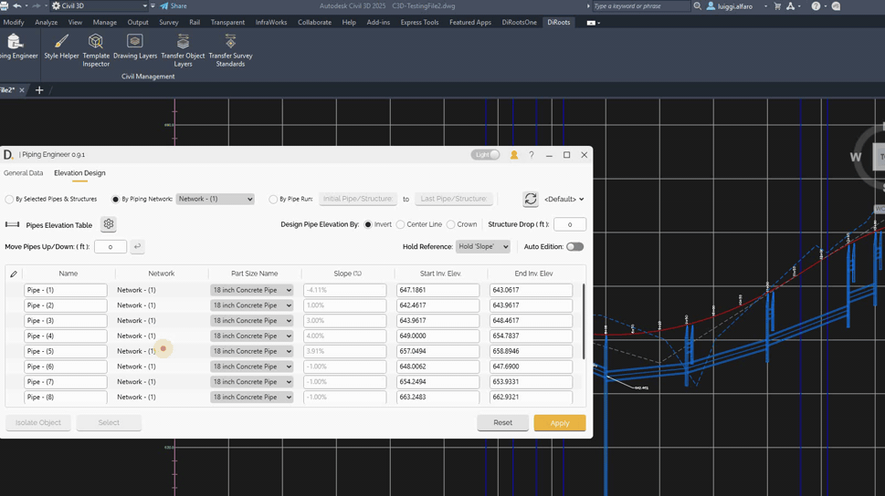
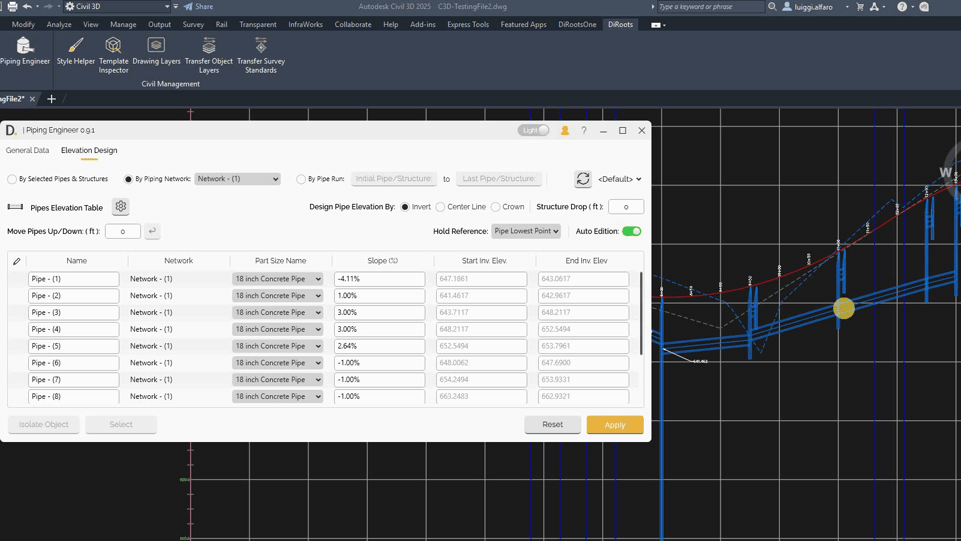
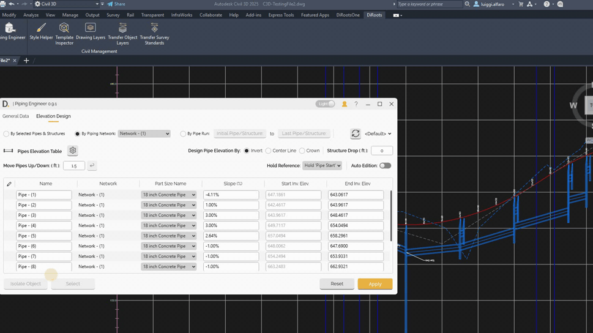

# Elevation Design
{: .no_toc }

## Table of contents
{: .no_toc .text-delta }

1. TOC
{:toc}

---

# Elevation Design

Piping Engineer provides advanced elevation design capabilities with auto-edition mode that includes hold reference options and automatic flow direction adjustments.

## Overview

Elevation design allows you to:
- Select the elevation design reference point (Invert, Center, or Crown) for displaying and calculating pipe elevations.
- Set structure drop values to position pipes at structure location based on flow direction.
- Control piping network elevations with multiple reference strategies
- Automatically adjust pipes near edited elements to maintain system flow by gravity (when Auto Flow Edition is enabled)
- Maintain system integrity during elevation modifications

By selecting the elevation design reference, setting the structure drop, and modifying the 'Slope', 'Start Elevation', 'End Elevation' and using the Edition Modes inputs of 'Hold Reference' and 'Auto Flow Edition', the user can design easily their pipes in elevation.

## Elevation Design Inputs

### Elevation Design Reference

The Elevation Design Reference feature allows you to select the pipe elevation reference point from which pipe elevations are displayed and calculated. This setting affects how the start and end elevations are shown in the table and how the elevations are calculated.

**Available Elevation Reference Options:**

- **Invert (Bottom)** - The default reference mode. Elevations are referenced from the bottom (invert) of the pipe.
- **Center** - Elevations are referenced from the center of the pipe.
- **Crown (Top)** - Elevations are referenced from the top (crown) of the pipe.

**How It Works:**

- Select the desired elevation reference using the radio button inputs in the interface.
- The table will automatically update to display the start and end elevations based on the selected reference point.

**Usage:**

- Select the Elevation Design Reference before modifying pipe elevations to ensure calculations use the correct reference point.
- Choose the reference that best matches your design workflow: Invert for standard pipe design, Center for pipe centerline elevations, or Crown for top-of-pipe elevations.

  
Note: the version on the image may not reflect the [latest version of DiCivil Package](https://diroots.com/civil-3d-plugins/dicivil/).

### Structure Drop

The Structure Drop feature allows you to automatically add a vertical drop at structure locations when designing pipes. This helps ensure pipes are positioned correctly at structures based on the flow direction.

**How It Works:**

- The Structure Drop input field allows you to specify a drop value (default is zero).
- When pipes are modified and the Structure Drop value is different from zero, the outlet pipe elevation from a structure is automatically calculated.
- The calculation uses the inlet pipe with the lowest elevation plus the specified drop value.
- This applies to all pipes in multi-selection scenarios.
- The drop is added between pipes at structure locations, following the flow direction of the system.

**Usage:**

- Set the Structure Drop value before modifying pipe elevations.
- When editing multiple pipes, the tool automatically applies the drop at structure locations based on flow direction.

  
Note: the version on the image may not reflect the [latest version of DiCivil Package](https://diroots.com/civil-3d-plugins/dicivil/).

## Elevation Design Modes

### 1. Auto Flow Edition

Auto Flow Edition is a toggle control that edits pipe elevation to keep the flow on the system. When enabled, the tool automatically updates pipes near the edited pipes to keep the system flow by gravity.

**Auto Flow Edition ON:**
- Automatically adjusts pipes near the edited elements to maintain system connectivity
- The pipe system is automatically moved up/down keeping the same slope, if the new edited pipe position no longer allows the system to flow by gravity
- Preserves the slopes of the affected pipes
- See [example 1](#example-1-adjusting-multiple-pipes-slope-with-auto-flow-edition) and [example 2](#example-2-adjusting-multiple-pipes-slope-with-auto-flow-edition)

**Auto Flow Edition OFF:**
- Modifies only the selected elements without affecting the rest of the system
- No automatic adjustments are made to maintain connectivity
- See [example 3](#example-3-moving-system-down-while-preserving-slopes)

### 2. Hold Reference Modes

The tool has the following options to hold or keep an existing reference so the pipes are modified maintaining their current reference elevation or slope.

#### 2.1. Hold Reference: Pipe Highest Point

Holds the highest point from the edited pipes as the elevation reference and allows adjustment of the slope. The user can modify multiple rows slope at the same time. See [example 1.](#example-1-adjusting-multiple-pipes-slope-with-auto-flow-edition)

#### 2.2. Hold Reference: Pipe Lowest Point

Holds the lowest point from the edited pipes as the elevation reference and allows adjustment of the slope. The user can modify multiple rows slope at the same time. See [example 2.](#example-2-adjusting-multiple-pipes-slope-with-auto-flow-edition)

#### 2.3. Hold Slope

Holds the slope of the edited pipes. The user can adjust start/end elevations and move the entire system up/down with the difference value. See [example 3.](#example-3-moving-system-down-while-preserving-slopes)

- Move entire system up or down while preserving slopes. Value moved is the difference between the edited and previous value.
- Only elevation values can be changed
- **Move Pipes Up/Down**: Directly input a delta value to move selected pipes up or down while preserving slopes
  - Input positive values to move pipes up
  - Input negative values to move pipes down
  - The feature is only available when pipes are selected
  - Changes are applied directly to the selected items using the custom enter button
  - See [example 4.](#example-4-moving-pipes-updown-with-delta-value)

#### 2.4. Hold Reference: Pipe Start or Pipe End

Holds the pipe start or pipe end as the elevation reference, or the user can modify the slope holding the same pipe start or end reference:

- **Pipe Start**. References the starting point elevation of the pipe
- **Pipe End**. Reference the ending point elevation of the pipe
- In this mode the user can modify the elevations directly using the edition modes
- See [example 5](#example-5-editing-pipe-holding-start-or-end-reference) 

## General Workflow

1. Refresh the latest data.
2. Select the Elevation Design Reference (Invert, Center, or Crown).
3. Set the Structure Drop value (if needed).
4. Identify the pipes to move.
5. Define the Hold Reference.
6. Enable or disable Auto Flow Edition.
7. Set the pipe(s) new values.
8. Apply changes.

## Workflow Examples

### Example 1: Adjusting Multiple Pipes Slope with Auto Flow Edition

-  **Identify pipes** that need adjustment and select them.
-  **Set Hold Reference**. Set the hold reference to the highest point of edited pipes. 
-  **Enable Auto Flow Edition** to automatically adjust pipes near the edited ones.
-  **Set pipe new values**. Enter new slope in multiple pipes (e.g. 4%).
-  **Apply changes**. The system adjusts selected pipes and automatically adjusts nearby pipes to maintain system connectivity.

  
Note: the version on the image may not reflect the [latest version of DiCivil Package](https://diroots.com/civil-3d-plugins/dicivil/).

### Example 2: Adjusting Multiple Pipes Slope with Auto Flow Edition

-  **Identify pipes** that need adjustment and select them.
-  **Set Hold Reference**. Set the hold reference to the lowest point of edited pipes. 
-  **Enable Auto Flow Edition** to automatically adjust pipes near the edited ones.
-  **Set pipe new values**. Enter new slope in multiple pipes (e.g. 3%).
-  **Apply changes**. The system adjusts selected pipes and automatically adjusts nearby pipes to maintain system connectivity.

Note: the version on the image may not reflect the [latest version of DiCivil Package](https://diroots.com/civil-3d-plugins/dicivil/).

### Example 3: Moving System Down While Preserving Slopes

-  **Identify pipes** to modify and select them. In this case the first pipe or pipes of the system to move up or down.
-  **Set Hold Reference and Auto Flow Edition**. Set the hold reference to "Hold Slope". Disable Auto Flow Edition to modify only selected elements.
-  **Modify elevation** (e.g. from 649 to 648 - moving system up 1 units).
-  **Apply changes**. The system moves up while preserving all slopes.

  
Note: the version on the image may not reflect the [latest version of DiCivil Package](https://diroots.com/civil-3d-plugins/dicivil/).

### Example 4: Moving Pipes Up/Down with Delta Value

-  **Identify pipes** to move and select them.
-  **Set Hold Reference**. Set the hold reference to "Hold Slope" to preserve pipe slopes during movement.
-  **Input delta value**. Enter the desired movement value directly (e.g., +2.5 to move up 2.5 units, or -1.5 to move down 1.5 units).
-  **Apply changes**. The selected pipes are moved up or down by the specified delta value while preserving all slopes.

  
Note: the version on the image may not reflect the [latest version of DiCivil Package](https://diroots.com/civil-3d-plugins/dicivil/).

### Example 5: Editing Pipe Holding Start or End Reference

This example demonstrates how to edit a pipe while holding either the start or end elevation reference. You can modify either the slope or the elevation while maintaining the selected reference point.

-  **Identify specific pipe** to modify.
-  **Set Hold Reference**. Set the hold reference to "Pipe Start" or "Pipe End" to maintain the reference point elevation.
-  **Set Auto Flow Edition**. Disable Auto Flow Edition to modify only selected elements.
-  **Modify pipe values**:
   1. To modify slope: Enter new slope value. The pipe slope is adjusted while the start or end elevation remains fixed.
   2. To modify elevation: Enter new elevation value. The elevation is adjusted while maintaining the selected reference point (start or end).
-  **Apply changes**. Selected pipes are modified without affecting the rest of the system.

Note: the version on the image may not reflect the [latest version of DiCivil Package](https://diroots.com/civil-3d-plugins/dicivil/).

