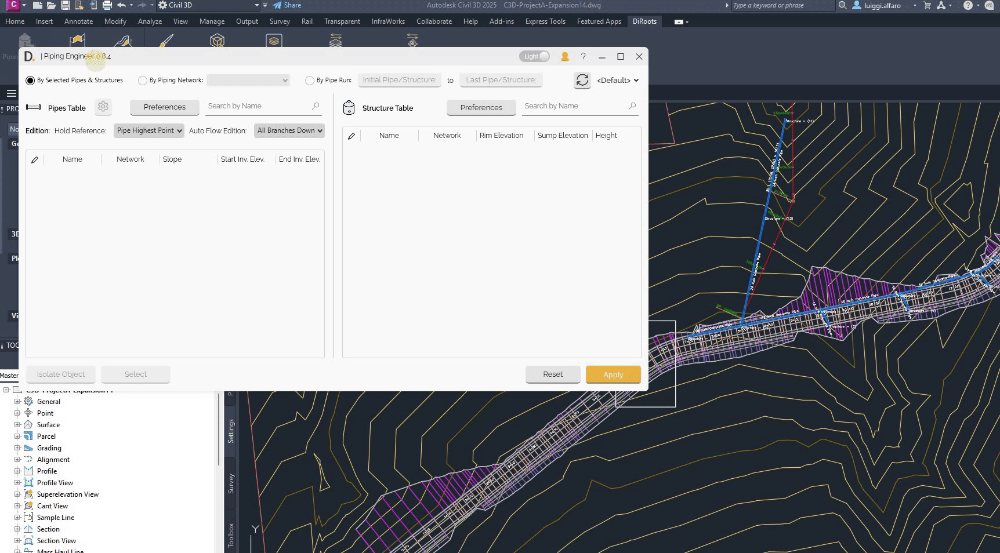
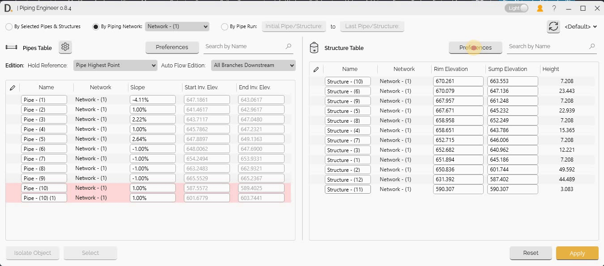
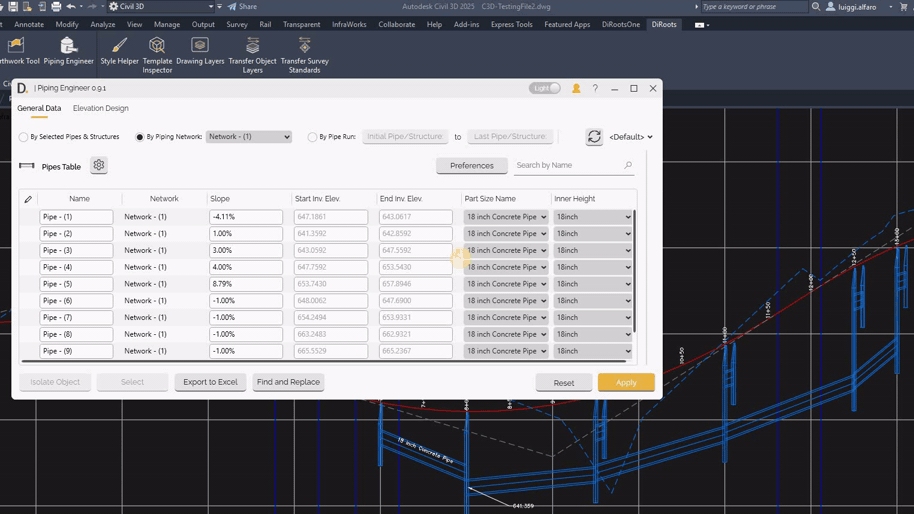
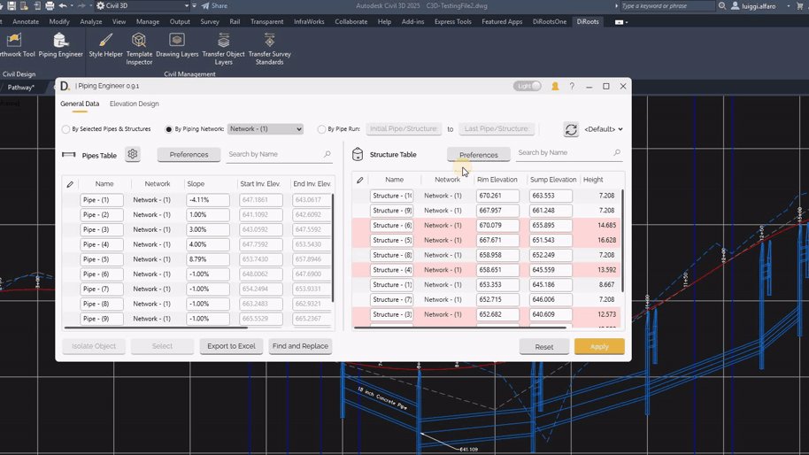

# Pipe and Structure Data Tables
{: .no_toc }

## Table of contents
{: .no_toc .text-delta }

1. TOC
{:toc}

---

# Selecting Network Data

The selection method applies to both the Elevation Design tab table and the General Data tables. The tool provides 3 modes to select your network data to display:

- **By Selection of Pipes/Structures** - Select the objects to show.
- **By Piping Network** - Select the network to display the data.
- **By Pipe Run** - Select the initial and last Pipe/Structure.

  
Note: the version on the image may not reflect the [latest version of DiCivil Package](https://diroots.com/civil-3d-plugins/dicivil/).

---

# Pipe and Structure Data Tables

Piping Engineer provides comprehensive table interfaces for managing pipes and structures with efficient data management and bulk operations capabilities.

## Overview

Pipe and structure data tables allow you to:

- Manage the pipes and structures data through independent table interfaces.
- Perform bulk operations on multiple elements.

## Table Column Preferences Customization

The tools allows you to customize the data columns you want to show in each of your tables by clicking on the 'Preferences' button and adding the required properties in the lef panel as shown below.

  
Note: the version on the image may not reflect the [latest version of DiCivil Package](https://diroots.com/civil-3d-plugins/dicivil/).

  
Note: the version on the image may not reflect the [latest version of DiCivil Package](https://diroots.com/civil-3d-plugins/dicivil/).

## Example Usage Cases

After configuring the column preferences of the table, the user can edit the properties required. For example, we have the following edition cases:

### Part Swapping

The user can select the pipes and swap their part directly from the table interface.

  
Note: the version on the image may not reflect the [latest version of DiCivil Package](https://diroots.com/civil-3d-plugins/dicivil/).

### Structure to Reference Surface Update

The user can select the structure and update the reference of the surface from the table interface.

  
Note: the version on the image may not reflect the [latest version of DiCivil Package](https://diroots.com/civil-3d-plugins/dicivil/).

---

# Additional Features

## Rule Validation Display

The tool hightligts the pipes/structures elements that are not complying with the rules in red background color 

  
Note: the version on the image may not reflect the [latest version of DiCivil Package](https://diroots.com/civil-3d-plugins/dicivil/).

## Quick Slope Override Rule 

Piping Engineer allows users to define a quick rule to check the slope range in the tool.

  
Note: the version on the image may not reflect the [latest version of DiCivil Package](https://diroots.com/civil-3d-plugins/dicivil/).

## Find and Replace

Piping Engineer includes the 'Find and Replace' feature to quickly find and replace property values across selected columns. This feature allows you to edit values efficiently by finding current editable property values and replacing them with new values, optionally adding prefixes and suffixes.

For more information about the 'Find and Replace' feature, including usage instructions, see the [Find and Replace section](../StyleHelper/SH-Editing-Features.md#find-and-replace) in the Style Helper User Guide.

## Refreshing Latest Data

The tool has a refresh button to update the latest data from the file.

  
Note: the version on the image may not reflect the [latest version of DiCivil Package](https://diroots.com/civil-3d-plugins/dicivil/).

## Basic Workflow

1. **Open Piping Engineer** - From the DiRoots tab.
2. **Select Network** - Choose the piping network to work with.
3. **Choose Tool** - Select the appropriate tool tab(Elevation Design, General Data.).
4. **Configure Settings** - Set up tool-specific parameters and options.
5. **Apply Changes** - Execute modifications and validate results.
6. **Save Profile** - Save configurations for future use.
