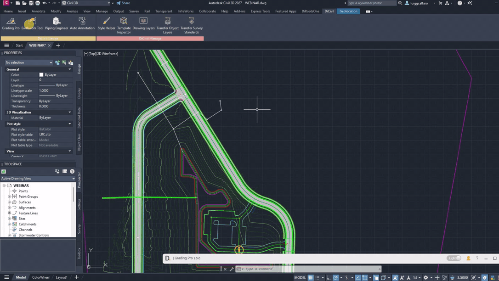

# Profile
{: .no_toc }

## Table of contents
{: .no_toc .text-delta }

1. TOC
{:toc}

---

# Profile

Piping Engineer profile makes it easy to save your settings and reuse them later.

## What's saved in the profile

The following settings are saved in the profiles.

- The customized Preferences for the Pipes Table.
- The customized Preferences for the Structure Table.
- The customized Override Rules Settings.

Note: the version on the image may not reflect the [latest version of DiCivil Package](https://diroots.com/civil-3d-plugins/dicivil/).
